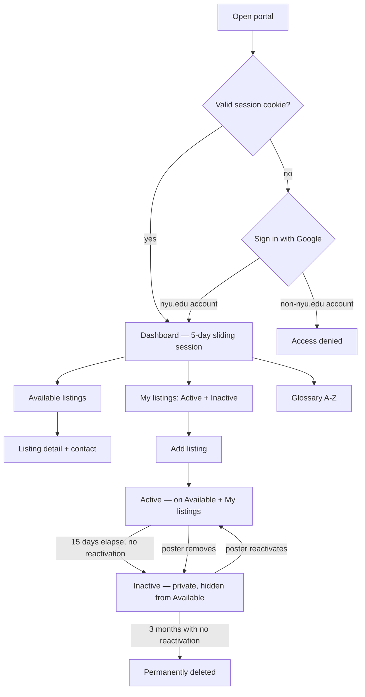

# NYU Off-Campus Housing Portal — Requirements

## Summary

An NYU-email-gated showcase portal where students sign in with their NYU Google account, stay signed in via a persistent session cookie, and use a three-tab dashboard to browse and filter Available listings, manage My listings (add/remove), and read an alphabetical renting Glossary. Contact is direct via listing details. No profiles, bookings, or payments.

---

## Problem Frame

NYU students find and share off-campus housing mainly through WhatsApp community chats and word of mouth. That works for reach but fails as a listing surface: posts get buried unless the poster re-shares daily; there is no way to tell if a place is still available without messaging; comparing options means scrolling chat history; photos are often gated behind “DM me for pictures”; and basic US renting concepts (lease takeovers, guarantors, utilities, laundromats) are tribal knowledge that international and first-time renters only learn by asking in the group.

The portal replaces that chaotic channel with a structured, NYU-only showcase. It does not become a booking or payment product — interested tenants contact the poster using the contact details on the listing.

---

## Key Decisions

- **Sign in with NYU Google account, then a persistent session.** The site is gated: signing in with a Google account on the `nyu.edu` Google Workspace domain is required before any content. Google (not the portal) verifies the student's identity; the portal only checks that the returned account's email/domain is `nyu.edu`. After a successful sign-in, a session cookie with a standard 5-day sliding expiry keeps the user signed in — Google sign-in is not required again on the same browser until the session expires or the user is idle for 5 days.
- **No registration or profiles, but sessions persist.** Signing in with an NYU Google account is enough to enter. No account setup, no profile page, no passwords or codes to manage — and the session survives closing the browser and returning later, up to the 5-day expiry.
- **Three-tab dashboard after login.** Every logged-in user sees: **Available listings** (default), **My listings**, and **Glossary**. No separate profile page.
- **Listing ownership = poster’s NYU email.** Listings the user posted under their verified email appear on **My listings**, where they can remove them or add a new one — no extra re-auth step while already logged in.
- **Auto-expiry after 15 days, with a private Inactive archive.** A listing automatically moves from Active to Inactive 15 days after it was posted or last reactivated. Removing a listing also moves it to Inactive immediately. Inactive listings never appear on Available listings and are visible only to the poster, in a dedicated Inactive section of **My listings**, where they can be reactivated (resetting the 15-day clock) or left alone. Inactive listings are permanently deleted after 3 months of inactivity. There is no public “taken” state — a listing is either live (Active) or gone from public view (Inactive).
- **Photos optional.** Users may list without images. Contact remains the path for more media if needed.
- **At least one contact method required.** When posting, the user must provide WhatsApp number, email, and/or phone — at least one. Interested students contact them outside the portal.
- **Glossary ships with starter copy.** v1 includes drafted short entries, shown in alphabetical order; depth is glossary-only, not a full how-to guide.
- **Showcase only.** No in-app messaging, bookings, payments, or applications.

---

## Actors

- A1. **Logged-in NYU student** — any verified `@nyu.edu` user. Can browse Available listings, manage My listings (add/remove), and read the Glossary. There are no separate account types or permission tiers.

---

## Key Flows

- F1. Enter the portal
  - **Trigger:** Visitor opens the site with no active session.
  - **Actors:** A1
  - **Steps:** Click "Sign in with Google" → redirected to Google's sign-in/consent screen → Google authenticates the student and returns to the portal → portal checks the account's email is on the `nyu.edu` domain → land on the dashboard (Available listings), with a session cookie set for future visits.
  - **Outcome:** Authenticated access to all three tabs without signing in again until the session cookie expires (5-day sliding window) or the user signs out. Non-`nyu.edu` Google accounts are rejected after Google sign-in completes. A rejected or failed sign-in shows an inline error with a path to retry.
  - **Covered by:** R1, R2, R3, R22

- F2. Browse and filter listings
  - **Trigger:** A1 is on (or opens) the **Available listings** tab.
  - **Actors:** A1
  - **Steps:** See all live listings with key details and photos when present → apply filters → open a listing for full detail and contact info.
  - **Outcome:** Side-by-side comparison via structured fields and filters; contact details visible on the listing.
  - **Covered by:** R5, R6, R7, R8

- F3. Post a listing
  - **Trigger:** A1 on **My listings** chooses Add listing.
  - **Actors:** A1
  - **Steps:** Fill structured fields → optionally upload photos → provide at least one contact method → submit → listing appears under Available listings and on My listings, owned by their NYU email.
  - **Outcome:** New live listing visible to all authenticated users.
  - **Covered by:** R9, R10, R11, R12, R13

- F4. Remove or reactivate own listings
  - **Trigger:** A1 on **My listings** wants to take down a listing they posted, or bring back one that expired or was removed.
  - **Actors:** A1
  - **Steps:** See only listings posted under their current NYU email, split into Active and Inactive → remove an Active listing (moves to Inactive) or reactivate an Inactive one (moves to Active, resets the 15-day clock).
  - **Outcome:** Removal/reactivation is immediate while the session is active, no extra OTP. Active listings also auto-expire to Inactive after 15 days with no poster action.
  - **Covered by:** R8, R9, R14, R19, R20, R21

- F5. Read the glossary
  - **Trigger:** A1 opens the **Glossary** tab.
  - **Actors:** A1
  - **Steps:** Browse short entries (a few paragraphs each), listed alphabetically, for common US/NYU renting terms.
  - **Outcome:** Enough context to understand listing language without asking in WhatsApp.
  - **Covered by:** R15, R16, R17

---

## Requirements

**Access**

- R1. The entire site is inaccessible until the visitor signs in with a Google account on the `nyu.edu` Google Workspace domain.
- R2. Google accounts outside the `nyu.edu` domain cannot gain access, even if the sign-in with Google itself succeeds.
- R3. After a successful sign-in, the user navigates freely across the dashboard, and stays signed in across browser restarts and future visits via a persistent session cookie with a 5-day sliding expiry (each authenticated visit resets the 5-day window). No account registration or profile. Sign-in is not required again on any tab, page change, or later visit until the session expires or the user is idle for 5 days.
- R22. If Google sign-in fails, is cancelled, or returns an account outside the `nyu.edu` domain, the user sees an inline error on the login page and a button to retry. This follows conventional OAuth-auth practice while staying minimal — no separate passwords, codes, account lockouts, or CAPTCHAs; Google itself handles the identity verification and any of its own abuse controls.

**Dashboard**

- R4. After login, every user sees a dashboard with three tabs: **Available listings** (default), **My listings**, and **Glossary**.

**Browse and compare**

- R5. On **Available listings**, authenticated users can view all live listings with enough structured detail to compare options without messaging first.
- R6. Each listing detail view shows all posted fields, any photos, and the poster’s contact methods.
- R7. Browse supports filters for: rent/price range; neighborhood or area; distance / NYU campus (e.g. Washington Square, Brooklyn); bedrooms / apartment type; move-in or availability date; lease type (including whether a guarantor is required); utilities included (including wifi); a "Vegetarian preferred" checkbox (unchecked listings are assumed open to non-veg tenants); gender preference (female-only, male-only, or no preference — defaults to no preference).
- R8. Only Active listings appear on Available listings; Inactive (removed or auto-expired) listings never appear there.
- R24. When applied filters match zero listings, Available listings shows a "No matching listings found" message instead of a blank grid.

**Posting and My listings**

- R9. On **My listings**, the user sees only listings they posted under their current verified NYU email, split into two sections: **Active** (with a control to remove each one) and **Inactive** (with a control to reactivate each one). A control to add a new listing is also present. If both sections are empty (e.g. a first-time visitor), My Listings shows a "You have zero listings" message instead of blank sections.
- R10. Adding a listing collects structured details including at least: location/area; distance or campus relevance; rent; utilities (including wifi); lease type and guarantor requirement; bedrooms/apartment type; move-in/availability; a "Vegetarian preferred" checkbox (defaults to unchecked, i.e. non-veg acceptable); a gender preference selector (female-only, male-only, or no preference — defaults to no preference); free-text description; and contact details.
- R11. Photos are optional; zero or more images may be attached.
- R12. When adding a listing, the user must provide at least one of: WhatsApp number, email, phone.
- R13. New listings are tied to the user’s verified NYU email and appear immediately on Available listings and on My listings.
- R14. Removing a listing from My listings requires a lightweight confirmation step (e.g. "Remove this listing? It will move to Inactive.") before it takes effect. Once confirmed, the listing moves from Active to Inactive immediately — it disappears from Available listings and from the Active section of My listings, but is not permanently deleted (see R21). No additional OTP is required while the user is already logged in.
- R19. An Active listing automatically moves to Inactive 15 days after it was posted or last reactivated, with no action required from the poster.
- R20. Reactivating an Inactive listing from My listings moves it back to Active — it reappears on Available listings and on the Active section of My listings — and restarts its 15-day expiry clock (R19).
- R21. An Inactive listing is permanently deleted 3 months after it became Inactive if it is not reactivated before then. Inactive listings are never shown on Available listings and are visible only to the poster in My listings.
- R23. Ownership checks for My Listings visibility, removal (R9, R14), and reactivation (R20) are enforced server-side against the email returned by Google sign-in (e.g. via a signed/opaque session identifier) — never against a client-supplied or display-layer email value.

**Glossary**

- R15. The **Glossary** tab provides short entries (a few paragraphs each) for terms such as lease takeover, guarantor, utilities, laundromat, and similar basics that are not common knowledge outside the US.
- R16. Glossary entries are displayed in alphabetical order.
- R17. v1 ships with drafted starter glossary content; depth stays glossary-only (not a full renting guide, map, or safety rating system).

**Contact model**

- R18. Interested tenants contact the poster only via the contact details on the listing. The portal does not provide in-app messaging, booking, or payment.

---

## Acceptance Examples

- AE1. Non-NYU Google account blocked
  - **Covers:** R1, R2
  - **Given:** A visitor signs in with a personal Google account, `student@gmail.com`
  - **When:** Google sign-in succeeds and returns to the portal
  - **Then:** Access is denied because the account is not on the `nyu.edu` domain; no portal content is shown

- AE2. Free navigation within and across sessions; sign-in again only after 5 days idle
  - **Covers:** R3, R4
  - **Given:** A student signed in with their NYU Google account and landed on Available listings
  - **When:** They switch to My listings, then Glossary, close the browser, and return the next day
  - **Then:** No new sign-in is required at any point — the session cookie keeps them signed in. Only after 5 days with no visit does the session expire, requiring a fresh sign-in on the next visit

- AE3. Filter and compare without DMing
  - **Covers:** R5, R6, R7
  - **Given:** Several live listings with rent, campus, lease type, and utilities filled in
  - **When:** A logged-in user filters by rent range and Washington Square distance on Available listings
  - **Then:** Matching listings show structured fields and contact info on the detail view without requiring a message first

- AE4. Post without photos, with one contact method
  - **Covers:** R9, R10, R11, R12, R13
  - **Given:** A logged-in user on My listings fills required fields, skips photos, and enters only a WhatsApp number
  - **When:** They submit
  - **Then:** The listing appears on Available listings and on My listings, owned by their NYU email

- AE5. Post rejected with no contact method
  - **Covers:** R12
  - **Given:** A logged-in user fills listing fields but leaves WhatsApp, email, and phone empty
  - **When:** They submit
  - **Then:** The listing is not created; they are prompted to add at least one contact method

- AE6. Owner removes when taken
  - **Covers:** R8, R9, R14
  - **Given:** A listing posted under `a@nyu.edu` is live (Active) and that student is logged in
  - **When:** They open My listings and remove the listing
  - **Then:** The listing no longer appears on Available listings for anyone, or in the Active section of My listings; it moves to the Inactive section, visible only to `a@nyu.edu`; no extra OTP was required

- AE7. Other email cannot see or remove someone else’s listings
  - **Covers:** R9, R14, R23
  - **Given:** A listing owned by `a@nyu.edu`
  - **When:** `b@nyu.edu` is logged in and opens My listings
  - **Then:** That listing does not appear; they cannot remove it

- AE8. Glossary is alphabetical
  - **Covers:** R15, R16
  - **Given:** Starter entries include Guarantor, Laundromat, and Lease takeover
  - **When:** A user opens the Glossary tab
  - **Then:** Entries appear in alphabetical order (e.g. Guarantor before Laundromat before Lease takeover)

- AE9. Listing auto-expires, then is reactivated
  - **Covers:** R8, R19, R20, R21
  - **Given:** A listing posted under `a@nyu.edu` has been Active for 15 days with no reactivation
  - **When:** The 15-day mark passes
  - **Then:** The listing moves to Inactive automatically and disappears from Available listings; when `a@nyu.edu` later reactivates it from My listings, it reappears on Available listings and its 15-day clock restarts. If left Inactive for 3 months with no reactivation, it is permanently deleted.

---

## Success Criteria

- A logged-in student can find and compare relevant live listings using filters without scrolling a chat or DMing for basic facts.
- A logged-in student can publish a structured listing once and keep it visible until they remove it — no daily re-posting.
- Availability is unambiguous: if it appears, it is live; if taken (or 15 days pass with no reactivation), it auto-expires to a private Inactive state and is gone from public view — without relying solely on the poster remembering to come back and delete it.
- Photos are available on the listing when the user added them; “DM for pictures” is no longer required for basic browsing.
- Glossary entries answer the common “what does this mean?” questions that currently clog WhatsApp threads.
- Only verified NYU emails can see or post anything.

---

## Scope Boundaries

**In v1**

- Sign in with NYU Google account once, then a persistent 5-day sliding-expiry session (no re-sign-in on return visits within that window)
- Three-tab dashboard: Available listings, My listings, Glossary
- Browse + filter live listings
- Add / remove own listings from My listings (ownership by NYU email)
- 15-day auto-expiry to a private Inactive archive, with poster-initiated reactivation and permanent deletion after 3 months of inactivity
- Optional photos; required structured fields; at least one contact method
- Short alphabetically ordered glossary with starter entries
- Direct contact via listing details only

**Deferred for later**

- User profiles or public poster pages
- Edit listing after post (v1 is add + remove)
- In-app messaging
- A public “taken” or archived status visible to other students (the v1 Inactive archive is private to the poster only, not a public status)
- Required photos
- Maps, commute times, or neighborhood safety ratings
- Full how-to renting guides beyond glossary depth
- Admin / operator UI for glossary editing
- Reporting / moderation workflows beyond “NYU email only”
- Notifications when new listings match filters

**Outside this product’s identity**

- Bookings, applications, waitlists
- Payments, deposits, or escrow
- Landlord/broker marketplace features aimed at non-students
- Replacing official NYU housing systems

---

## Dependencies / Assumptions

- NYU's Google Workspace domain is `nyu.edu`, and students sign in to it with their NYU Google account (this is the identity source of truth; the portal does not verify email addresses itself).
- A Google Cloud OAuth 2.0 Client ID/Secret can be created (no NYU IT involvement required) and its authorized redirect URIs kept in sync with each deployment domain.
- “NYU account” means Google accounts on the `nyu.edu` Workspace domain (planning may refine aliases such as school-specific subdomains if needed).
- Students are willing to publish contact details on a student-only site.
- Glossary starter copy will be drafted as part of build/content work.
- The product is a showcase, not a party to any lease; disclaimers may be needed at planning/copy time.

---

## Outstanding Questions

**Deferred to Planning**

- Exact listing field schema and validation rules (required vs optional beyond what R10–R12 pin).
- How campus distance is captured (preset campuses vs free text vs approximate miles).
- Photo limits (count, size, formats) and storage approach.
- Google Cloud OAuth consent screen settings (app name, logo, verification status) and which redirect URIs to register for local/preview/production.
- Glossary entry list for the v1 starter set.
