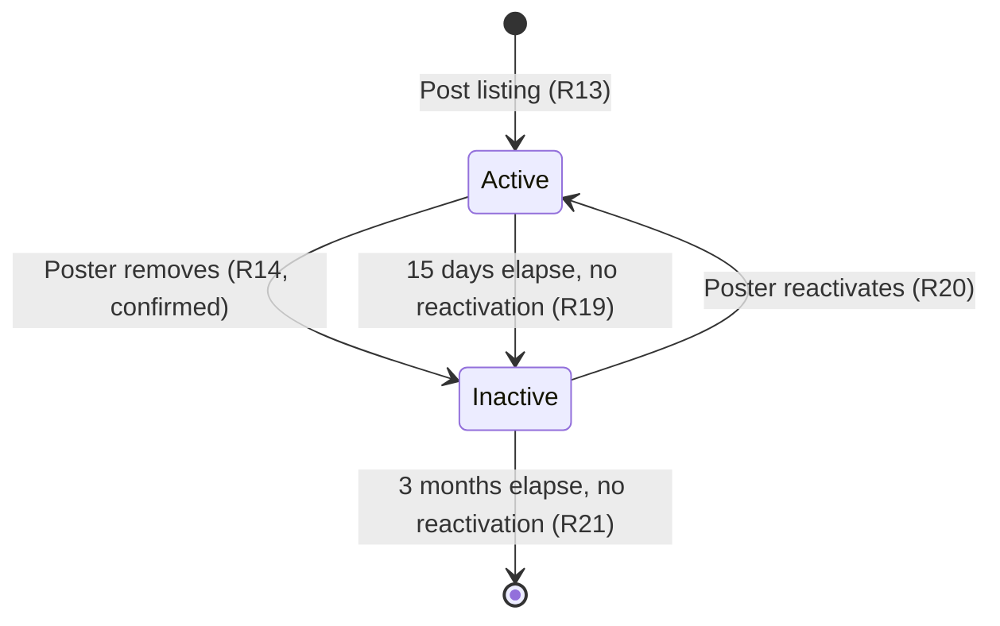
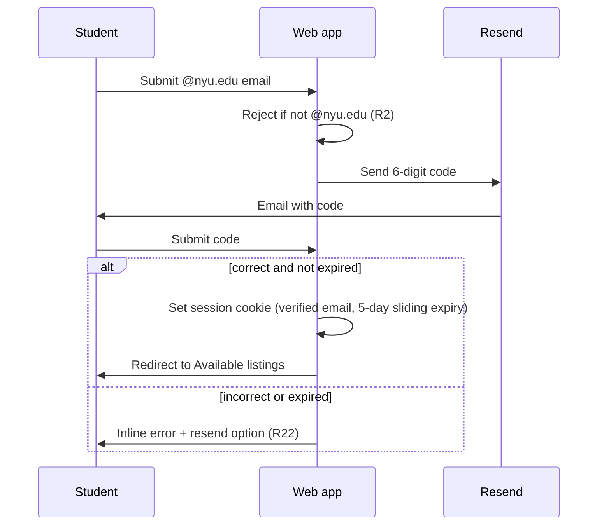

# NYU Off-Campus Housing Portal

## Summary

Build an NYU-email-gated showcase for off-campus housing listings: OTP-verified students browse and filter Available listings, manage their own listings on My Listings (Active/Inactive, with auto-expiry and reactivation), and read an alphabetical renting glossary. No bookings, payments, or in-app messaging.

## Problem Frame

NYU students currently trade housing leads through WhatsApp chats, where posts get buried, availability is unverifiable without messaging, comparison requires scrolling chat history, and US renting concepts (guarantors, lease takeovers) are tribal knowledge. This plan replaces that channel with a structured showcase (see origin for full problem frame).

**Target repo:** this repo (currently empty — no existing code, git history, or chosen stack).

---

## Requirements

Carried forward from the origin document; grouped by capability. IDs match the origin's R-IDs.

**Access & session**

- R1, R2. Site is gated by `@nyu.edu` OTP verification; non-NYU emails are rejected.
- R3. One-time OTP, then a persistent session with a 5-day sliding expiry that survives browser restarts and later visits.
- R22. Incorrect/expired OTP shows an inline error with a resend path, under a cooldown and attempt limit.
- R23. Ownership checks are enforced server-side against the OTP-verified email, never a client-supplied value.

**Dashboard**

- R4. Three-tab dashboard after login: Available listings (default), My listings, Glossary.

**Browse & filter**

- R5, R6. Available listings shows all Active listings with structured detail, photos, and contact info on the detail view.
- R7. Filters: rent range, neighborhood/area, campus distance, bedrooms/type, move-in date, lease type/guarantor, utilities, vegetarian-preferred checkbox, gender preference.
- R8. Only Active listings appear on Available listings.
- R24. Zero-match filter combinations show a "No matching listings found" message.

**Posting & listing lifecycle**

- R9. My Listings shows the poster's own listings split into Active and Inactive sections, with remove and reactivate controls and an add-listing control; a "You have zero listings" message when both sections are empty.
- R10, R11, R12, R13. Adding a listing collects structured fields (including the vegetarian and gender preference selectors), optional photos, at least one contact method, and is tied to the poster's verified email.
- R14. Removing a listing requires a confirmation step, then moves it to Inactive immediately.
- R19, R20, R21. An Active listing auto-expires to Inactive after 15 days with no reactivation; reactivating restores it to Active and restarts the clock; an Inactive listing is permanently deleted after 3 months with no reactivation.

**Glossary**

- R15, R16, R17. Alphabetical glossary of US/NYU renting terms, starter content shipped in v1.

**Contact model**

- R18. Tenants contact posters only via listing contact details; no in-app messaging, booking, or payment.

---

## Key Technical Decisions

- **KTD1. Stack: Next.js (App Router, TypeScript) + Postgres via Prisma, deployed on Vercel.** A single repo covering frontend, API routes, and background jobs is the fastest path to this MVP's scope, and Vercel's native Cron and Blob primitives are used directly by KTD4 and KTD6.
- **KTD2. Session: persistent, signed httpOnly cookie carrying the OTP-verified email, with a 5-day sliding expiry.** `Max-Age` is set to 5 days and refreshed on every authenticated request (rolling expiry), so a returning user within that window is never re-prompted for OTP, satisfying R3. The cookie — not any client-supplied field — is the source of truth for identity, satisfying R23.
- **KTD3. OTP delivery and rate limits via Resend.** 6-digit code, 10-minute expiry, 30-second resend cooldown, 5 verify attempts per code before a new code is required, 5 code requests per email per hour. These are concrete, minimal defaults resolving R22 and the origin's OTP rate-limit open question.
- **KTD4. Listing lifecycle via a daily Vercel Cron job.** One scheduled job calls an internal API route that (a) moves Active listings past 15 days to Inactive and (b) permanently deletes Inactive listings past 3 months. Day-granularity batch processing is sufficient for R19–R21 and avoids a per-listing real-time scheduler.
- **KTD5. Campus/distance as a preset enum, not geocoding.** A fixed list of NYU campuses/neighborhoods (Washington Square, Brooklyn, etc.) gives exact-match filtering for R7 without a mapping vendor dependency.
- **KTD6. Photos via Vercel Blob, capped at 6 per listing, 5MB each, jpg/png/webp.** Resolves the origin's photo-limits open question with MVP-appropriate caps.
- **KTD7. Ownership enforcement at the query layer.** Every My Listings read or mutation filters and authorizes by the session cookie's email; the email is never accepted from request body/query params. Directly satisfies R23 and AE7.

---

## High-Level Technical Design

Listing lifecycle state machine (R8, R14, R19–R21):

OTP authentication sequence (R1–R3, R22):

---

## Implementation Units

### U1. Project scaffolding, data model, and deployment config

- **Goal:** Stand up the Next.js app, Prisma schema, and Vercel project so later units have a working foundation to build on.
- **Requirements:** R7, R10, R19–R21 (schema shapes these).
- **Dependencies:** none.
- **Files:** `package.json`, `next.config.ts`, `prisma/schema.prisma`, `src/lib/db.ts`, `src/lib/env.ts`, `.env.example`, `vercel.json`.
- **Approach:** Scaffold Next.js App Router + TypeScript. Define Prisma models: `Listing` (fields per R10, `status: Active | Inactive`, `activatedAt`, `inactivatedAt`), `ListingPhoto`, `OtpCode` (email, code hash, expiry, attempt count), and a `Campus` enum matching KTD5's preset list. Configure Postgres connection string, Vercel Blob token, and Resend API key as environment variables.
- **Patterns to follow:** none — greenfield repo.
- **Test scenarios:**
  - Happy path: `prisma migrate` runs cleanly against a fresh database and creates all tables.
  - Edge case: `Listing.status` defaults to `Active` on creation.
  - Test expectation: schema-level test verifying `Listing`, `ListingPhoto`, and `OtpCode` models have the fields required by R10–R21.
- **Verification:** `prisma migrate dev` succeeds; the app builds and boots locally against the configured database.

### U2. OTP authentication and session

- **Goal:** Gate the entire app behind `@nyu.edu` OTP verification with a persistent, sliding-expiry session so users are not re-prompted on later visits.
- **Requirements:** R1, R2, R3, R22, R23.
- **Dependencies:** U1.
- **Files:** `src/app/(auth)/login/page.tsx`, `src/app/api/auth/request-otp/route.ts`, `src/app/api/auth/verify-otp/route.ts`, `src/lib/auth.ts`, `src/middleware.ts`, `src/app/(auth)/login/page.test.tsx`, `src/lib/auth.test.ts`.
- **Approach:** Middleware checks the session cookie on every route under the dashboard; unauthenticated or expired requests redirect to `/login`. `request-otp` validates the `@nyu.edu` domain, rate-limits by email (KTD3), generates and emails a code via Resend. `verify-otp` checks the code against `OtpCode`, tracks attempts, and on success sets the signed cookie with a 5-day `Max-Age` (KTD2) and clears the used code. Middleware refreshes the cookie's `Max-Age` on every authenticated request to implement the sliding window.
- **Execution note:** Test-first for the OTP verify/rate-limit logic — the attempt-limit and cooldown behavior is easy to get subtly wrong.
- **Test scenarios:**
  - Happy path: valid `@nyu.edu` email receives a code; correct code within the window sets the 5-day session cookie.
  - Happy path: authenticated session persists across tab navigation with no repeat OTP prompt. Covers AE2.
  - Happy path: authenticated session persists across a simulated browser close/reopen the next day, with no repeat OTP prompt, and the cookie's expiry is refreshed. Covers AE2.
  - Edge case: a session cookie older than 5 days with no intervening visit is rejected; the next request redirects to `/login`. Covers AE2.
  - Error path: non-`@nyu.edu` email is rejected before any code is sent. Covers AE1.
  - Error path: incorrect code shows inline error; 6th consecutive incorrect attempt on the same code requires a new code request.
  - Error path: 6th code request for the same email within an hour is rejected with a rate-limit message.
  - Integration: setting the session cookie on verify makes subsequent API routes resolve `req.session.email` without any client-supplied identity field.
- **Verification:** a fresh `@nyu.edu` email can complete OTP and reach the dashboard; a non-NYU email cannot; a wrong code is rejected with a visible retry path.

### U3. Post and manage listings

- **Goal:** Let a logged-in student add a listing and manage their own listings (Active/Inactive, remove, reactivate) on My Listings.
- **Requirements:** R9, R10, R11, R12, R13, R14, R20, R23.
- **Dependencies:** U1, U2.
- **Files:** `src/app/(dashboard)/my-listings/page.tsx`, `src/app/(dashboard)/my-listings/new/page.tsx`, `src/app/api/listings/route.ts`, `src/app/api/listings/[id]/route.ts`, `src/app/api/listings/[id]/reactivate/route.ts`, `src/lib/listings.ts`, `src/app/(dashboard)/my-listings/page.test.tsx`, `src/lib/listings.test.ts`.
- **Approach:** `POST /api/listings` validates required fields and the at-least-one-contact-method rule (R12), uploads any photos to Vercel Blob (max 6, 5MB each), and creates the listing owned by `req.session.email`. My Listings queries listings `WHERE posterEmail = req.session.email`, split into Active/Inactive sections. Remove and reactivate mutations filter by the same session-derived email (KTD7) and require the listing to belong to the caller. Remove shows a confirmation dialog before calling the API (R14).
- **Test scenarios:**
  - Happy path: submitting required fields with no photos and one contact method creates a listing visible on My Listings (Active) and Available listings. Covers AE4.
  - Happy path: reactivating an Inactive listing moves it back to Active and resets `activatedAt`. Covers AE9.
  - Edge case: My Listings shows "You have zero listings" when both sections are empty.
  - Edge case: uploading 7 photos is rejected; a >5MB photo is rejected.
  - Error path: submitting with no WhatsApp/email/phone is rejected with a prompt to add one. Covers AE5.
  - Error path: attempting to remove or reactivate a listing not owned by the caller's session email returns 403/not-found. Covers AE7.
  - Integration: removing a listing without confirming does not call the delete mutation; confirming does, and the listing disappears from Available listings and moves to the Inactive section. Covers AE6.
- **Verification:** a listing can be added, appears in both places, is removed with confirmation, reappears on reactivation, and one student can never modify another's listing.

### U4. Browse and filter Available listings

- **Goal:** Let logged-in students browse and filter live listings and view full detail.
- **Requirements:** R5, R6, R7, R8, R18, R24.
- **Dependencies:** U1, U2, U3 (listings must exist to browse).
- **Files:** `src/app/(dashboard)/listings/page.tsx`, `src/app/(dashboard)/listings/[id]/page.tsx`, `src/app/api/listings/search/route.ts`, `src/lib/listing-filters.ts`, `src/app/(dashboard)/listings/page.test.tsx`, `src/lib/listing-filters.test.ts`.
- **Approach:** `/api/listings/search` accepts the filter set from R7 and queries `WHERE status = 'Active'` plus the requested filters (all filters AND together). The grid renders structured fields and photos; the detail view additionally shows contact methods (R6, R18). Zero matches render the R24 empty-state message instead of a blank grid.
- **Test scenarios:**
  - Happy path: filtering by rent range and campus returns only matching Active listings with contact info visible on the detail view. Covers AE3.
  - Edge case: a filter combination matching zero listings renders "No matching listings found", not a blank grid. Covers R24.
  - Edge case: an Inactive listing never appears in search results even if it matches all filters. Covers R8.
  - Integration: the vegetarian-preferred checkbox and gender-preference filter combine correctly with the other six filter dimensions (AND semantics).
- **Verification:** filtering behaves predictably across all eight filter dimensions, and Inactive listings are unreachable from Available listings.

### U5. Listing lifecycle jobs

- **Goal:** Automatically move stale listings to Inactive and permanently delete long-inactive ones, without poster action.
- **Requirements:** R19, R21.
- **Dependencies:** U1, U3.
- **Files:** `src/app/api/cron/expire-listings/route.ts`, `vercel.json` (cron schedule), `src/lib/listing-lifecycle.ts`, `src/lib/listing-lifecycle.test.ts`.
- **Approach:** A Vercel Cron job (daily) calls an internal API route protected by a cron secret. The route runs two batch queries: move `Active` listings with `activatedAt` older than 15 days to `Inactive`; hard-delete `Inactive` listings with `inactivatedAt` older than 3 months (cascading their photos in Blob storage).
- **Test scenarios:**
  - Happy path: an Active listing posted 16 days ago (no reactivation) is moved to Inactive by the job. Covers AE9.
  - Happy path: an Inactive listing inactivated 3 months and 1 day ago is permanently deleted, including its Blob-stored photos.
  - Edge case: an Active listing reactivated 14 days ago is not expired by the job (clock correctly reset by R20).
  - Edge case: an Inactive listing reactivated within the 3-month window is excluded from permanent deletion.
  - Error path: the cron route rejects requests without the correct cron secret.
- **Verification:** running the job against seeded fixture data produces exactly the expected Active→Inactive and Inactive→deleted transitions with no other listings affected.

### U6. Glossary tab

- **Goal:** Ship the read-only alphabetical glossary of renting terms.
- **Requirements:** R15, R16, R17.
- **Dependencies:** U1, U2.
- **Files:** `src/app/(dashboard)/glossary/page.tsx`, `src/lib/glossary.ts`, `src/app/(dashboard)/glossary/page.test.tsx`.
- **Approach:** Glossary entries are a static, version-controlled list (no admin UI, per origin scope) sorted alphabetically at render time. Starter entries cover lease takeover, guarantor, utilities, laundromat, and similar terms; exact copy is a content-authoring task deferred to implementation (see Open Questions).
- **Test scenarios:**
  - Happy path: entries render in alphabetical order regardless of source-list order. Covers AE8.
  - Test expectation: `none` for content correctness beyond ordering — copy accuracy is a content review task, not a unit test concern.
- **Verification:** the glossary tab renders the starter entries alphabetically with no editing UI present.

---

## Scope Boundaries

Carried forward from the origin document.

**In v1:** OTP gating with a persistent 5-day sliding-expiry session, three-tab dashboard, browse/filter, add/remove/reactivate own listings with 15-day auto-expiry and 3-month permanent deletion, optional photos, required structured fields, alphabetical starter glossary, direct contact only.

**Deferred for later:** user profiles, edit-after-post, in-app messaging, a public "taken" status (the Inactive archive is private to the poster), required photos, maps/commute/safety ratings, full renting guides, admin/operator UI, moderation workflows beyond NYU-email gating, filter-match notifications.

**Outside this product's identity:** bookings/applications/waitlists, payments/deposits/escrow, non-student marketplace features, replacing official NYU housing systems.

---

## Risks & Dependencies

- **OTP deliverability to `@nyu.edu` inboxes** depends on Resend's sending reputation and NYU's mail filtering; verify with a real test send before relying on it for launch.
- **NYU email-alias normalization** — if NYU issues school-specific alias domains that resolve to the same student, R23's strict email-match ownership model could lock a student out of their own listing across aliases. Not resolved in this plan; flagged as an open question below.
- **Vercel Cron granularity** — daily batch runs mean R19/R21 transitions land within a day of the exact 15-day/3-month thresholds, not to the minute. Acceptable for this product's showcase nature.
- **Longer-lived session cookie widens the theft window** — a 5-day sliding-expiry cookie is valid for longer than a per-visit OTP session, so a stolen/leaked cookie grants longer access. Mitigated by `httpOnly`, `secure`, and `SameSite` cookie flags plus signing (KTD2); no additional session-revocation UI is in scope for v1.

## Open Questions

- Exact starter glossary entry list and copy — content-authoring task for U6, not a technical blocker.
- Exact preset campus/neighborhood list for the `Campus` enum (U1) — easy to extend post-launch; start with NYU's primary campuses and Brooklyn.
- Whether NYU issues alias domains that need normalizing to a single canonical identity for ownership matching (see Risks) — verify with NYU IT or real student test accounts before launch.

## Dependencies / Prerequisites

- Vercel project with Postgres (Vercel Postgres or Neon), a Vercel Blob store, and a Resend account with a verified sending domain.
- Vercel CLI installed as a project-local dev dependency (not globally) for environment/deploy management during implementation; Cursor's Vercel plugin is also available during `ce-work` execution.

## Sources & Research

This repo is currently empty — no existing code, `docs/solutions/`, `STRATEGY.md`, or `CONCEPTS.md` to draw local patterns or institutional learnings from. The technology stack, OTP provider, and photo storage were settled directly with the user (Next.js/Prisma/Postgres, Resend, Vercel Blob); these are well-documented, standard integrations, so no additional external research was dispatched for this plan.
